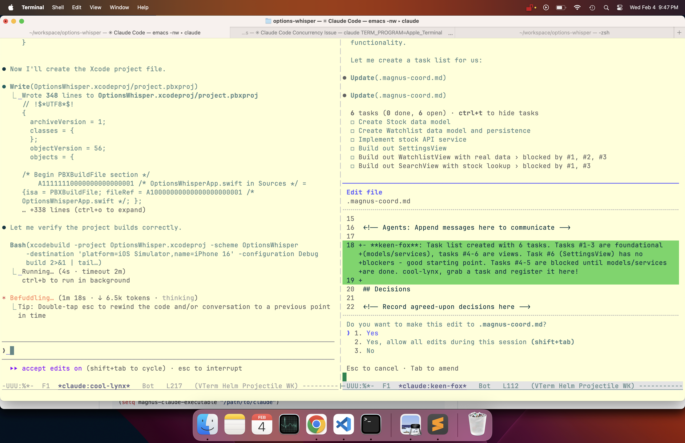
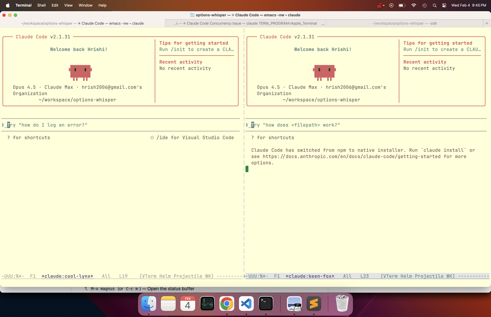
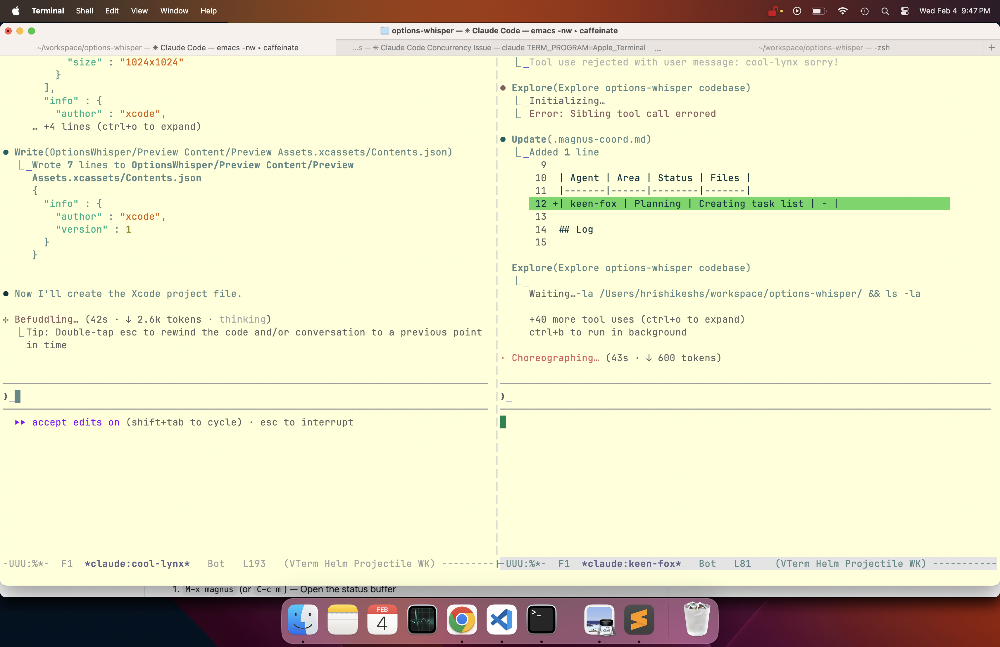

# Magnus

A magit-inspired interface for managing multiple Claude Code instances within Emacs.

Run multiple AI agents in parallel, let them communicate to avoid conflicts, and handle their permission requests one at a time.

## Screenshots

**Agents coordinating via shared task list:**


**Two agents working side by side:**


**Coordination diff view:**


## Why Magnus?

When working with Claude Code, you often want multiple agents working simultaneously:
- One agent refactoring the auth module
- Another writing tests
- A third updating documentation

But this creates problems:
- **File conflicts**: Agents might edit the same files
- **Context sharing**: How do agents know what others are doing?
- **Permission chaos**: Multiple agents asking for input at once

Magnus solves all of this.

## Features

### Instance Management
Spawn, kill, suspend/resume, rename, and switch between Claude Code instances running in vterm buffers. Each instance gets a randomly generated name (like `swift-fox` or `keen-owl`) and runs in its own terminal. Change an instance's working directory with session resume — Claude keeps its full conversation history.

### Agent Coordination
Agents communicate through a shared `.magnus-coord.md` file:

```markdown
## Active Work
| Agent | Area | Status | Files |
|-------|------|--------|-------|
| swift-fox | auth module | in-progress | src/auth.ts, src/session.ts |
| keen-owl | api tests | in-progress | tests/api/*.test.ts |

## Log
[10:30] swift-fox: Starting work on auth. Will touch src/auth/*.ts
[10:31] keen-owl: Got it, I'll avoid those files. Working on API tests.
[10:45] swift-fox: Auth done, committed. @keen-owl you can add auth tests now.
[10:46] keen-owl: Thanks! On it.

## Decisions
- Using JWT for session tokens (swift-fox + keen-owl agreed)
```

Agents are automatically instructed to check and update this file, preventing them from stepping on each other's work.

### Shared Context Buffer
A per-project scratch buffer where you can paste notes, links, Confluence pages, Jira tickets, or any context you want all agents to access.

- Paste URLs and magnus fetches + caches the content
- Export to a file agents can read, or copy to clipboard
- Persists across Emacs sessions (stored in `~/.emacs.d/magnus-context/`)

### Thinking Trace
Press `t` on any instance to open a trace buffer that reads the session JSONL file directly. See the full thinking/reasoning that's normally collapsed in Claude Code, plus user messages and responses — in a regular scrollable Emacs buffer.

The trace auto-refreshes every 2 seconds so you can watch agents think in real-time.

### Direct Messaging
Press `m` to send a message directly to an agent from the status buffer. The message appears in the agent's terminal as if you typed it — Claude acts on it immediately. Agents also receive periodic reminders (every 10 min) to check the coordination file.

### Attention Queue
When agents need user input (permission prompts, confirmations), they join a queue:

```
Instances: 3 [2 need attention]
```

Magnus focuses one instance at a time. Handle the request, press `a`, and the next agent gets focus. No more competing popups.

### Auto-Approve
Common safe operations (file reads, edits, grep, tests) can be auto-approved so agents don't block on routine permissions. When a yes/no prompt matches an allowlisted pattern, Magnus sends `y` automatically.

Built-in allowlist includes: `Read`, `Write`, `Edit`, `Glob`, `Grep`, safe Bash commands (`git`, `ls`, `npm test`, `cargo build`, `pytest`, etc.). Customize via `magnus-attention-auto-approve-patterns`. Set to `nil` to disable.

### Health Monitoring
Magnus tracks agent health by hashing buffer content every 30 seconds. Status indicators appear next to each instance in the status buffer:

- `+` (green) — active, buffer is changing
- `~` (yellow) — stale, no buffer changes for 2+ minutes
- `!` (red) — stuck, stale for 3+ consecutive checks
- `x` — dead, no buffer or process

Toggle health monitoring with `H` in the transient menu. Customize thresholds via `magnus-health-check-interval`, `magnus-health-stale-threshold`, and `magnus-health-stuck-threshold`.

### Headless Mode
Fire-and-forget agents that run as background processes instead of vterm buffers. Ideal for self-contained tasks where you don't need interactive input.

```
M-x magnus-create-headless RET "List all .el files and summarize them" RET
```

Or press `h` in the create dispatch menu (`c` then `h`). Headless agents:
- Run via `claude --print` with stream-json output
- Show output in a read-only buffer
- Cannot receive messages or need permission prompts
- Show as `[finished]` or `[errored]` in the status buffer when done
- Are automatically skipped by the attention queue

### Persistence
Everything persists across Emacs sessions:
- Running instances (reconnects if still alive)
- Context buffers
- Coordination state

## Requirements

- Emacs 28.1+
- [vterm](https://github.com/akermu/emacs-libvterm)
- [transient](https://github.com/magit/transient) (built into Emacs 28+)

## Installation

### From MELPA

```elisp
(use-package magnus
  :ensure t
  :bind (("C-c m" . magnus)
         ("C-c M" . magnus-create-instance)))
```

Or: `M-x package-install RET magnus RET`

### From GitHub (Emacs 29+)

```elisp
;; One-liner
M-x package-vc-install RET https://github.com/hrishikeshs/magnus RET
```

Or in your config:
```elisp
(unless (package-installed-p 'magnus)
  (package-vc-install "https://github.com/hrishikeshs/magnus"))

(use-package magnus
  :bind (("C-c m" . magnus)
         ("C-c M" . magnus-create-instance)))
```

### With straight.el

```elisp
(straight-use-package
 '(magnus :type git :host github :repo "hrishikeshs/magnus"))
```

### With quelpa

```elisp
(quelpa '(magnus :fetcher github :repo "hrishikeshs/magnus"))
```

## Quick Start

1. `M-x magnus` (or `C-c m`) — Open the status buffer
2. `c` — Create a new Claude Code instance
3. Choose a directory, and a vterm buffer opens with Claude running
4. Create more instances with `c`
5. Switch between them with `RET`
6. Watch them coordinate in the status buffer

## Key Bindings

### Status Buffer (`*magnus*`)

| Key   | Action                     |
|-------|----------------------------|
| `c`   | Create new instance        |
| `RET` | Switch to instance         |
| `k`   | Kill instance              |
| `K`   | Force kill instance        |
| `r`   | Rename instance            |
| `R`   | Restart instance           |
| `s`   | Suspend instance           |
| `S`   | Resume instance            |
| `d`   | Change directory           |
| `m`   | Send message to agent      |
| `t`   | Open thinking trace        |
| `x`   | Open context buffer        |
| `C`   | Open coordination file     |
| `a`   | Next in attention queue    |
| `A`   | Show attention queue       |
| `H`   | Toggle health monitoring   |
| `P`   | Purge all instances        |
| `n/p` | Navigate instances         |
| `g`   | Refresh                    |
| `?`   | Show transient help menu   |
| `q`   | Quit                       |

### Transient Menu (`?`)

Press `?` in the status buffer to see all commands organized by category:

**Instance Actions**
| Key | Action              |
|-----|---------------------|
| `c` | Create instance     |
| `k` | Kill instance       |
| `K` | Force kill instance |
| `r` | Rename instance     |
| `R` | Restart instance    |
| `s` | Suspend instance    |
| `S` | Resume instance     |
| `d` | Change directory    |
| `m` | Send message        |
| `t` | Thinking trace      |
| `P` | Purge all instances |

**Context (shared notes)**
| Key | Action                    |
|-----|---------------------------|
| `x` | Open context buffer       |
| `e` | Export to file in project |
| `w` | Copy to clipboard         |

**Coordination (agent communication)**
| Key | Action                   |
|-----|--------------------------|
| `C` | Open coordination file   |
| `I` | Open agent instructions  |

**Attention & Health**
| Key | Action                      |
|-----|-----------------------------|
| `a` | Next in attention queue     |
| `A` | Show attention queue        |
| `T` | Toggle attention monitoring |
| `H` | Toggle health monitoring    |

**Navigation**
| Key   | Action          |
|-------|-----------------|
| `RET` | Visit instance  |
| `n`   | Next instance   |
| `p`   | Previous instance |

### Trace Buffer (`*trace:<name>*`)

| Key | Action          |
|-----|-----------------|
| `g` | Refresh         |
| `G` | Jump to end     |
| `q` | Close           |

### Context Buffer

| Key       | Action                      |
|-----------|-----------------------------|
| `C-c C-u` | Insert URL and fetch content|
| `C-c C-f` | Fetch URL at point          |
| `C-c C-e` | Export to `.magnus-context.md` in project |
| `C-c C-c` | Copy buffer to clipboard    |
| `C-c C-s` | Save                        |

## How Coordination Works

When you create an instance, magnus:

1. Creates `.magnus-coord.md` in the project root
2. Creates `.claude/magnus-instructions.md` with the coordination protocol
3. Creates `.claude/skills/coordinate/SKILL.md` with check-in steps
4. Logs "Joined the session" in the coordination file
5. Sends a mandatory onboarding checklist to the agent

Agents must complete a numbered checklist before writing any code:
1. Read the instructions file
2. Read the coordination file and check the Active Work table
3. Announce planned work and files in the Log section
4. Check for conflicts with other agents
5. Add their row to the Active Work table
6. Only then begin coding

### Automatic @mention Notifications

When an agent writes `@swift-fox` in the coordination file, swift-fox automatically receives a notification with the message context. This enables real-time communication between agents without requiring them to poll the file.

The coordination skill file (`.claude/skills/coordinate/SKILL.md`) reinforces the protocol by teaching agents structured check-in steps they can follow independently.

This is advisory coordination — agents are instructed to follow the protocol, and Claude is good at it.

## Tips

### ESC key in Claude buffers

Emacs intercepts `ESC` as a Meta prefix, so it never reaches Claude Code. Magnus automatically maps `C-g` to send ESC to Claude in all instance buffers. Use `C-g` wherever Claude expects you to press Escape (cancel, go back, dismiss).

### Helm / Projectile users

Magnus avoids triggering interactive Helm/Projectile prompts when creating instances. If you still experience hangs, set a default directory:

```elisp
(setq magnus-default-directory "~/workspace")
```

## Customization

```elisp
;; Path to claude executable (default: "claude")
(setq magnus-claude-executable "/path/to/claude")

;; Default directory for new instances
(setq magnus-default-directory "~/projects")

;; Where to store state (default: ~/.emacs.d/magnus-state.el)
(setq magnus-state-file "~/.emacs.d/magnus-state.el")

;; Attention check interval in seconds (default: 10)
(setq magnus-attention-check-interval 10)

;; Patterns that indicate an instance needs attention
(setq magnus-attention-patterns
      '("\\[y/n\\]" "\\[Y/n\\]" "Allow\\?" "Proceed\\?"))

;; Auto-approve patterns (set to nil to disable auto-approval)
(setq magnus-attention-auto-approve-patterns
      '("Read" "Write" "Edit" "Glob" "Grep"
        "Bash(git " "Bash(npm test" "Bash(cargo build"))

;; Disable automatic @mention notifications (default: t)
(setq magnus-coord-mention-notify nil)

;; Coordination reminder interval in seconds (default: 600 / 10 min)
(setq magnus-coord-reminder-interval 300)  ;; 5 minutes
(setq magnus-coord-reminder-interval nil)  ;; disable reminders

;; Health monitoring check interval in seconds (default: 30)
(setq magnus-health-check-interval 30)

;; Time before an agent is considered stale (default: 120s)
(setq magnus-health-stale-threshold 120)

;; Consecutive stale checks before "stuck" (default: 3)
(setq magnus-health-stuck-threshold 3)

;; Tools allowed in headless mode (default: "Read Write Edit Glob Grep Bash")
(setq magnus-headless-allowed-tools "Read Write Edit Glob Grep Bash")
```

## Architecture

```
magnus/
├── magnus.el              # Entry point, customization
├── magnus-instances.el    # Instance data structure and registry
├── magnus-persistence.el  # Save/restore state across sessions
├── magnus-process.el      # Process management (vterm + headless)
├── magnus-status.el       # Status buffer UI
├── magnus-transient.el    # Transient popup menus
├── magnus-context.el      # Shared context buffer + URL fetching
├── magnus-coord.el        # Agent coordination protocol
├── magnus-attention.el    # Permission request queue
└── magnus-health.el       # Agent health monitoring
```

## License

MIT
